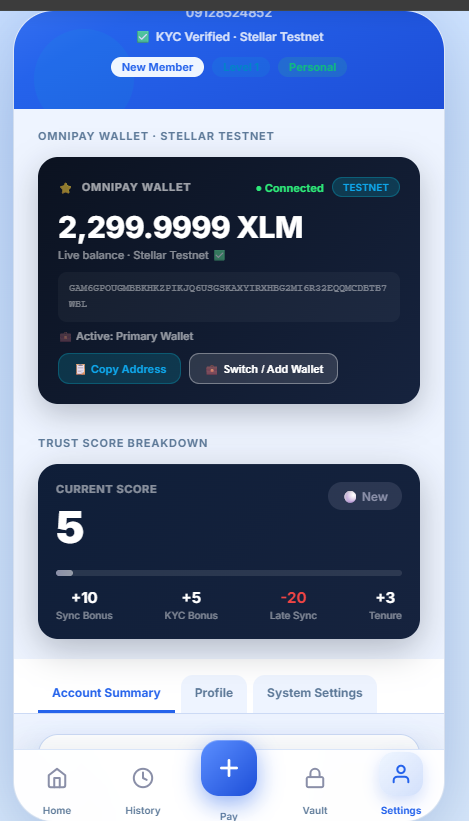
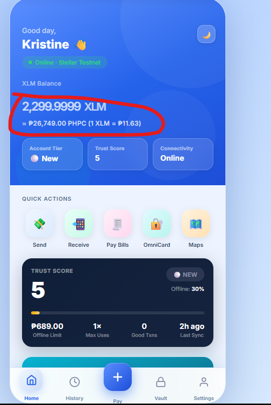
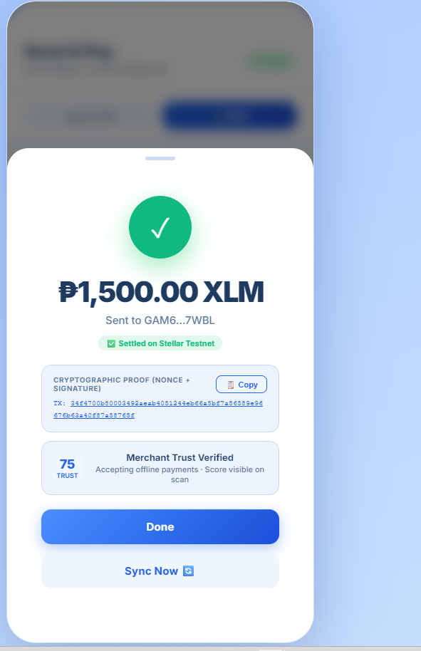
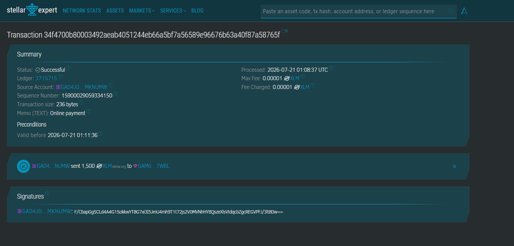

# OmniPay

**Disaster-Resilient Payments on Stellar — Built for the 20 Million Filipinos Who Can't Afford a Bad Connection.**

---

> *"Imagine it's payday. You're at your local sari-sari store, ready to buy dinner. You open your phone... but the screen just keeps loading. No signal. No data. Just a loading icon that never ends."*
>
> — OmniPay Pitch, Christian Mendigoria

---

## What Is This

OmniPay is a mobile-first fintech app built on the **Stellar testnet** that solves one specific, underserved problem: **what happens to digital payments when the internet disappears?**

In remote barangays across the Philippines, network outages aren't edge cases — they're Tuesday. Typhoons knock out towers. Mountains block signals. But people still need to buy rice, pay rent, send money home.

OmniPay is a three-layer payment ecosystem:

| Layer | What it does | When it works |
|---|---|---|
| **Online (Stellar)** | Real XLM transactions via Freighter wallet | Always — when connected |
| **Offline Vault** | Cryptographically signed payment tokens, Soroban-settled on sync | No internet needed |
| **SMS Gateway** *(roadmap)* | Transaction signed locally, relayed via SMS to OmniLink node | Signal but no data |

At every layer, **Stellar is the final settlement truth.** Offline is temporary. The blockchain is permanent.

---

## Why Stellar

Stellar isn't just a chain we picked for the hackathon. It's the right chain for this problem:

- **Low fees** — a ₱0.05 transaction cost means micro-payments are viable for sari-sari stores
- **Fast finality** — 3–5 second settlement, not 10 minutes
- **Soroban smart contracts** — the Offline Vault's collateral locking, nonce tracking, and fraud detection live here
- **Stellar anchors** — the roadmap to real PHP on/off-ramps through local money services
- **Global interoperability** — OFW remittances settling on the same infrastructure as your local tindahan payment

The answer to *"why blockchain here?"* is simple: **auditability, cross-border interoperability, and tamper-proof settlement the moment connectivity returns.** Not because blockchain is cool.

---

## Level 1 — What's Built

This submission covers **White Belt (Level 1)**: wallets, balances, and real on-chain transactions.

### ✅ Wallet Setup
- Full **Freighter wallet integration** via the browser extension API
- On first registration: Stellar keypair generated, funded via **Friendbot** (10,000 XLM on testnet), confirmed on-chain before the user sees the home screen
- Wallet state persisted across sessions via localStorage + Firebase Firestore

### ✅ Wallet Connection / Disconnection
- Connect: Freighter extension detected, public key pulled, XLM balance fetched from Horizon
- Watch-only wallets: add any Stellar address by public key — useful for monitoring without signing rights
- Disconnect: session cleared, Firestore listener torn down, UI returns to login

### ✅ Balance Handling
- `fetchLiveXLMBalance()` polls **Horizon testnet** (`https://horizon-testnet.stellar.org`) for the real on-chain balance
- Balance displayed in three places: home hero card, Settings wallet card, and the inline send form — all stay in sync after every transaction
- Live XLM → local currency conversion (PHP, USD, etc.) via CoinGecko + CryptoCompare with a static fallback

### ✅ Transaction Flow
- `doSendMoney()` builds a real Stellar payment operation using the **Stellar SDK**, signs with the custodial key or Freighter, and submits to Horizon
- Full error handling: `op_underfunded`, `tx_bad_auth`, network timeouts — each surfaces a specific message, not a generic failure
- **Success state**: modal with amount, truncated recipient, "Settled on Stellar Testnet" badge, real TX hash with a clickable **Stellar Expert explorer link**
- **Failure state**: inline toast with the exact Horizon error code

### ✅ QR Receive Flow
- Receiver enters amount → live PHP equivalent shown → QR generated with amount embedded (`omnipay:GADDRESS?amount=10.5&label=Name`)
- Sender scans QR → amount and recipient pre-filled automatically → one tap to send
- After settlement: sender history updated locally + synced to Firestore; receiver gets a real-time toast notification via Firestore `onSnapshot`

---

## Screenshots

### 1. Wallet Connected State
> *Settings screen showing active Freighter/custodial wallet, public key, and network badge*



---

### 2. Balance Displayed
> *Home screen hero card with live XLM balance and PHP equivalent*



---

### 3. Successful Testnet Transaction
> *Send & Pay screen after submitting a real XLM payment on Stellar testnet*



---

### 4. Transaction Result Shown to User
> *Success modal with transaction hash and Stellar Expert explorer link*



---

## The Offline Vault (Level 1 Preview)

Even in this Level 1 build, the Offline Vault architecture is visible. Here's how the fraud model works — and more importantly, how we're honest about it:

**We do not prevent offline double-spend. We make it economically irrational at scale.**

| Trust Score | Offline Limit | Max Uses Before Sync |
|---|---|---|
| 0–25 (New) | 30% of balance | 1× only |
| 26–50 | 50% of balance | 2× |
| 51–75 | 65% of balance | 4× |
| 76–100 (VIP) | 80% of balance | Unlimited |

If fraud is detected on sync: trust resets to 0, offline mode locked, balance clawback initiated via Soroban.

The bounded exposure model is identical to how **Visa/Mastercard offline floor limits** work. The fraud detection on sync mirrors **Chaum 1983 blind signature** principles, updated for a Soroban settlement layer.

> *"We don't eliminate offline fraud. We make it economically impossible to exploit at scale."*

---

## Setup — Run Locally

### Prerequisites

- A modern browser (Chrome or Brave recommended)
- [Freighter Wallet](https://freighter.app/) browser extension installed
- No backend server required — this is a self-contained single-file app

### Quick Start

```bash
# Clone the repo
git clone https://github.com/YOUR_USERNAME/omnipay.git
cd omnipay

# The app is a single HTML file — open it directly
open lib/db/src/index.html
```

Or serve it locally if you want camera/clipboard APIs without HTTPS warnings:

```bash
# Python (built-in)
python3 -m http.server 8080 --directory lib/db/src

# Then open: http://localhost:8080/index.html
```

### First Run

1. **Register** — fill in your name, phone, and set a PIN
2. The app generates a Stellar keypair and calls **Friendbot** to fund it with 10,000 testnet XLM
3. Once funded (3–5 seconds), you land on the home screen with your balance
4. **Connect Freighter** (optional) — click the Freighter icon in Settings to link your extension wallet

### Sending Your First Transaction

1. Go to **Pay → Send**
2. Paste any valid Stellar testnet address (`G…`, 56 characters)
3. Enter an XLM amount
4. Hit **Send XLM →**
5. The transaction is built, signed, and submitted to Horizon testnet in real time
6. Success modal shows your TX hash — click it to verify on Stellar Expert

### Testing the QR Flow

1. **User A**: tap **Receive** on the home screen → enter amount → tap **Generate QR**
2. **User B**: go to **Pay → Scan QR** → tap **Open Camera** → scan User A's QR
3. Amount and recipient are pre-filled → tap **Send XLM →**
4. Both users see a history entry; User A gets a real-time push notification

---

## Tech Stack

| Layer | Technology |
|---|---|
| Frontend | Vanilla JS, HTML5, CSS3 — zero framework dependencies |
| Blockchain | Stellar Testnet via [Stellar SDK v10](https://stellar.github.io/js-stellar-sdk/) |
| Wallet | [Freighter](https://freighter.app/) browser extension + custodial keypair |
| Smart Contracts | Soroban (Rust) — Offline Vault escrow *(Level 2+)* |
| Database | Firebase Firestore — user profiles, transaction history, real-time sync |
| QR | [qrcodejs](https://github.com/davidshimjs/qrcodejs) (generate) + [jsQR](https://github.com/cozmo/jsQR) (decode) |
| Rates | CoinGecko API + CryptoCompare fallback |

---

## Roadmap

```
⚪ White Belt  (Level 1) ← YOU ARE HERE
   Wallets, balances, real testnet transactions, QR send/receive

🟡 Yellow Belt (Level 2)
   Soroban Offline Vault contract (Rust), multi-wallet support,
   real-time event sync, trust score system on-chain

🟠 Orange Belt (Level 3)
   Full mini dApp — offline payment simulation, pre-signed token
   transfer (phone-to-phone via QR/BT), Soroban sync + fraud detection demo

🟢 Green Belt  (Level 4)
   SMS Gateway integration, functional offline-to-online settlement MVP,
   Stellar Anchor for PHP on/off-ramp

🔵 Blue Belt   (Level 5)
   50+ users onboarded, D.O.R.I.S. solar kiosk hardware demo,
   DESFire NFC card tap-to-pay, professional pitch deck

⚫ Black Belt  (Level 6)
   Stellar Mainnet launch, 20+ active mainnet users,
   Barangay Learning Hub pilot (Talisay, Bataan), security audit
```

---

## Built By

**Christian Mendigoria**

*"Together, let's build a payment system that works for everyone, everywhere."*

Every transaction ultimately settles on the Stellar blockchain — delivering secure, low-cost, and globally interoperable digital payments to the communities that need them most.

---

## License

MIT
